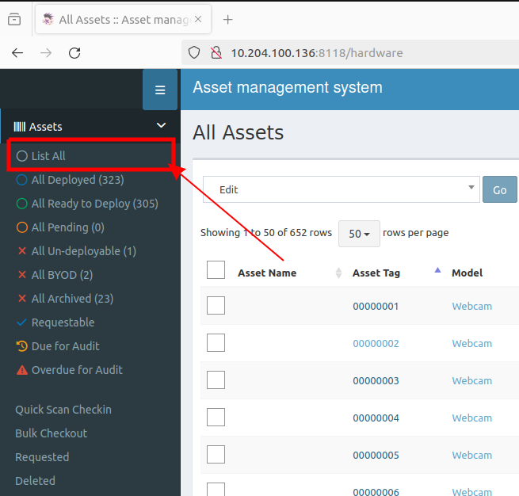
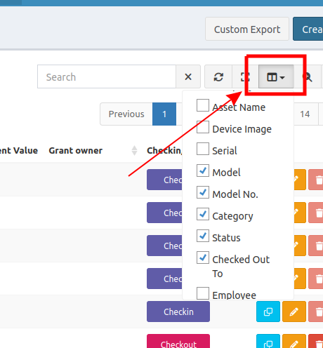

At left side panel, you can list all assets.

## Toggle necessary columns

Usually, the table may (or may not) show necessary information, **Asset Tag**, **Asset model**, **Asset model NO**. I suggest to enable these columns by click at the top right of table. 

