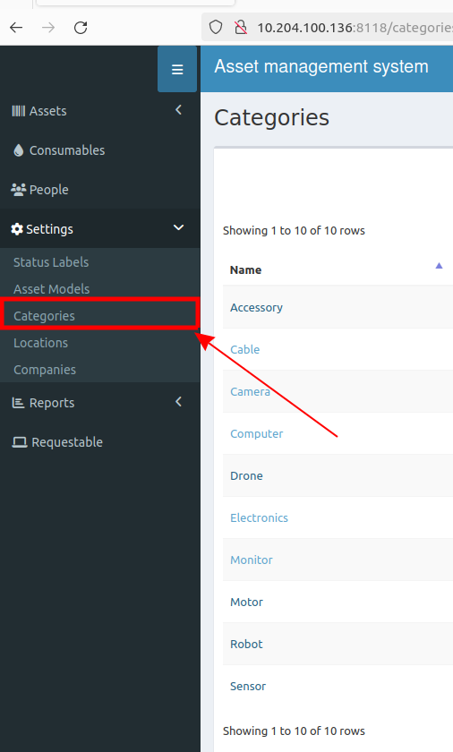
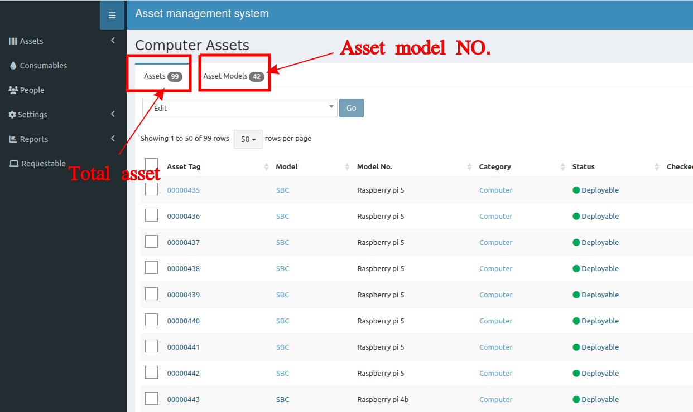

## List all categories
At left menu, Go to **Setting >> Categories**. This will show all types of assets in lab.

In each category, you can click to view the total amount of assets belonging to it. Additionally, you can also view various asset model types on this page.

