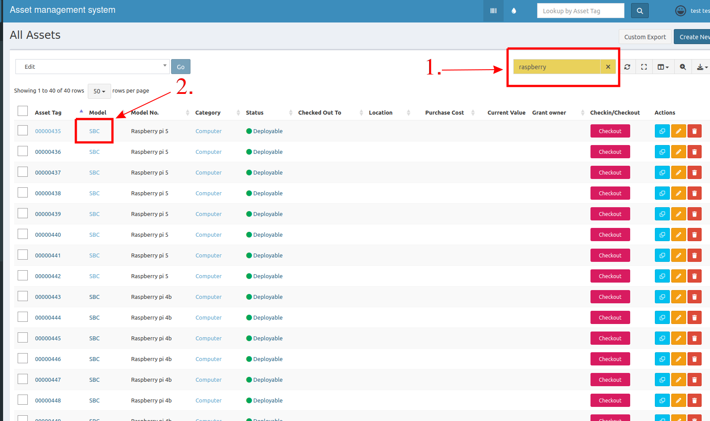
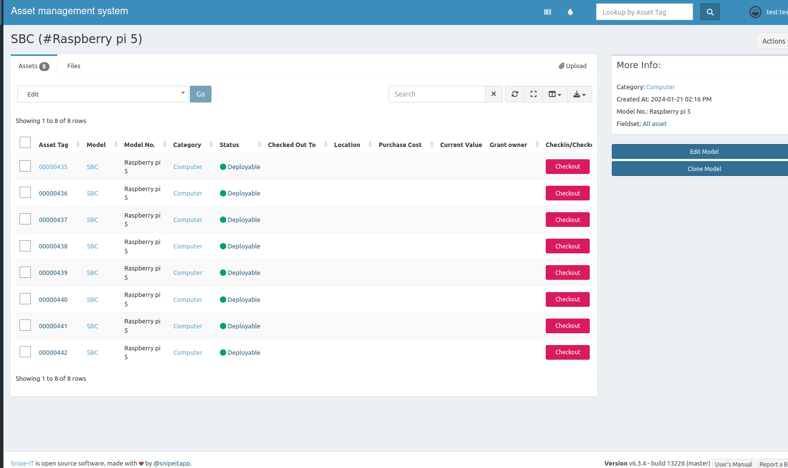
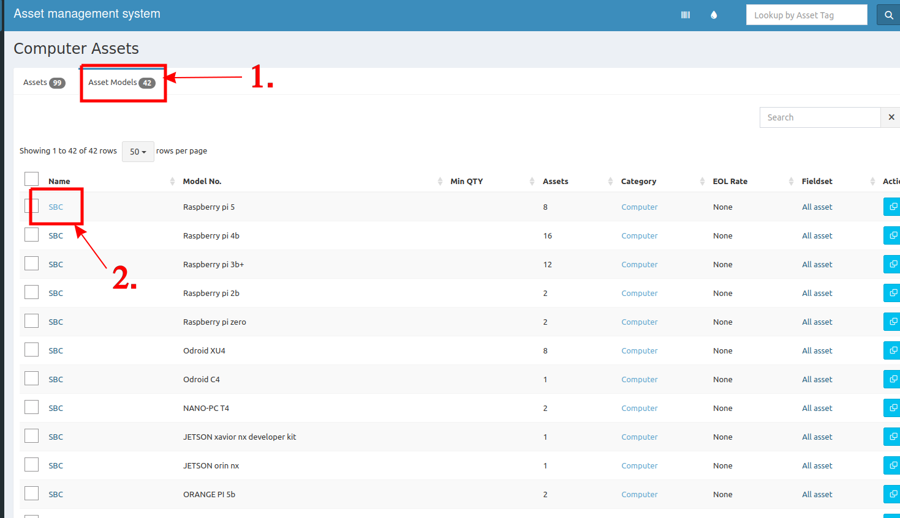

Sometimes you just want to know how many of this kind of device are left in the lab. Here are the recommended ways to check it.

## Search from  List All page
1. At top right, type your item in search box.
2. Click some of listed asset in model column.

3. The result will show information of the asset model NO.

## Search from categories page
1. Navigate to **Asset Models** tap in categories page.
2. Click on your needed model.

