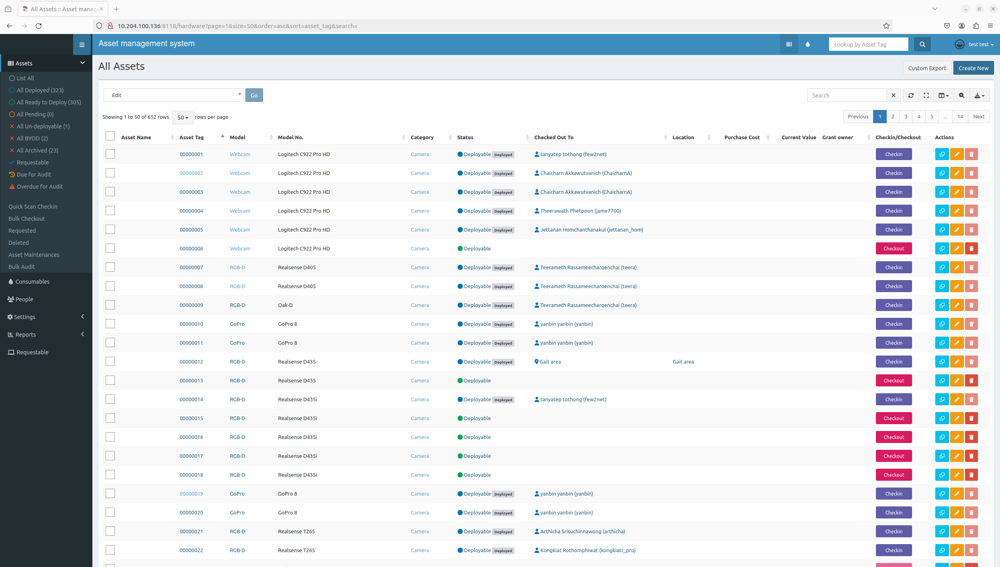

VISSET is an asset management system which is built up by [Snipe-IT](https://github.com/snipe/snipe-it) - An Open Source Asset Management System.

For more feature and coding, please follow the official github

This guide was created to fully utilized Snipe-IT in Robotics lab.

